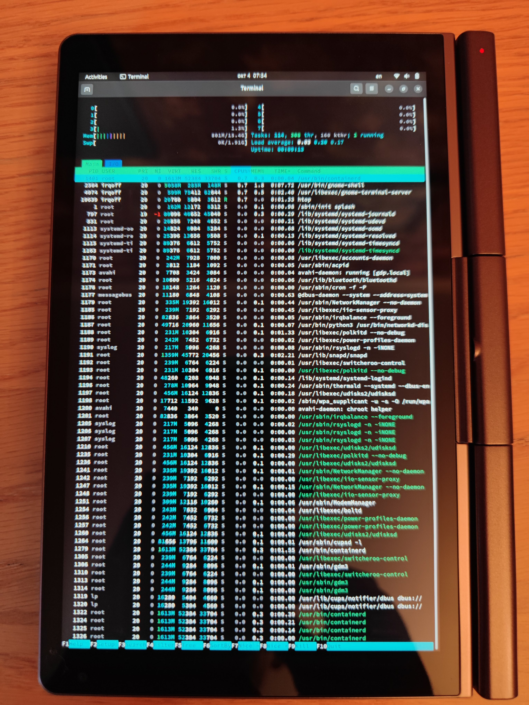

# Ansible for Jammy Jellyfish

Just execute it:
```
./jammy.sh
```

For run without jammy.sh need to run `sudo true && export ANSIBLE_PYTHON_INTERPRETER=/home/${USER}/.pyenv/versions/3.10.7/envs/ansible/bin/python3` and then `ansible-playbook jammy.yml`

# GPD Pocket 3



Steps:
 * `./jammy.sh`
 * `sudo true && export ANSIBLE_PYTHON_INTERPRETER=/home/${USER}/.pyenv/versions/3.10.7/envs/ansible/bin/python3`
 * `ansible-playbook jammy.yml -t pocket3 -e pocket3=yes`
 * reboot
 * `ansible-playbook jammy.yml -t pocket3 -e pocket3=yes -e pocket3_after_reboot=yes`
